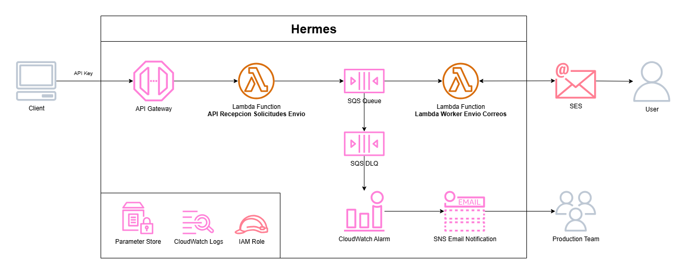

# Hermes con CDK .NET

- [Hermes con CDK .NET](#hermes-con-cdk-net)
  - [Introducción](#introducción)
  - [Recursos Requeridos](#recursos-requeridos)
    - [API Gateway Custom Domain Name](#api-gateway-custom-domain-name)
    - [SES](#ses)
  - [Recursos Creados](#recursos-creados)
    - [Colas](#colas)
      - [SQS Queue y Dead Letter Queue](#sqs-queue-y-dead-letter-queue)
      - [SNS Topic](#sns-topic)
      - [CloudWatch Alarm](#cloudwatch-alarm)
      - [Systems Manager String Parameter](#systems-manager-string-parameter)
    - [API Recepcion Solicitudes Envio](#api-recepcion-solicitudes-envio)
      - [Log Group](#log-group)
      - [IAM Role](#iam-role)
      - [Lambda Function](#lambda-function)
      - [Access Log Group](#access-log-group)
      - [Lambda Rest API](#lambda-rest-api)
      - [API Mapping](#api-mapping)
      - [Usage Plan](#usage-plan)
      - [API Key](#api-key)
      - [API Gateway Permission](#api-gateway-permission)
      - [Systems Manager String Parameter](#systems-manager-string-parameter-1)
    - [Lambda Worker Envio Correos](#lambda-worker-envio-correos)
      - [Systems Manager String Parameter](#systems-manager-string-parameter-2)
      - [Log Group](#log-group-1)
      - [IAM Role](#iam-role-1)
      - [Lambda Function (con Event Source)](#lambda-function-con-event-source)
  - [Despliegue](#despliegue)
    - [Variables y Secretos de Entorno](#variables-y-secretos-de-entorno)

## Introducción

* Hermes es una herramienta para el envío masivo de correos.
* El siguiente repositorio es para desplegar Hermes, lo que incluye la creación de [Lambdas](https://aws.amazon.com/es/lambda/), [API Gateway](https://aws.amazon.com/es/api-gateway/), [SQS Queues](https://aws.amazon.com/es/sqs/), [CloudWatch Alarms](https://aws.amazon.com/es/cloudwatch/), [SNS Topics](https://aws.amazon.com/es/sns/).
* La infraestructura se despliega mediante IaC, usando [AWS CDK en .NET 8.0](https://docs.aws.amazon.com/cdk/api/v2/dotnet/api/).
* El despliegue CI/CD se lleva a cabo mediante  [GitHub Actions](https://github.com/features/actions).



## Recursos Requeridos

### API Gateway Custom Domain Name

Es necesario contar con un Custom Domain Name ya asociado a API Gateway, esto dado a que se usará para crear el API Mapping.

<ins>Código donde se usará Custom Domain Name</ins>

```csharp
using Amazon.CDK.AWS.Apigatewayv2;

// Creación de la CfnApiMapping para el API Gateway...
CfnApiMapping apiMapping = new(this, ..., new CfnApiMappingProps {
    DomainName = domainName,
    ApiMappingKey = ...,
    ApiId = ...,
    Stage = ...,
});
```

Para ver un ejemplo de como crear un Custom Domain Name: [BDiazEApiGatewayCDK](https://github.com/bdiaze/BDiazEApiGatewayCDK)

### SES

Además, es necesario contar con un SES Identity ya verificado, el cual será usado en el Worker de Envio de Correos para proceder con las notificaciones.

<ins>Código donde se enviará correo mediante SES</ins>

```csharp
using Amazon.SimpleEmailV2;
using Amazon.SimpleEmailV2.Model;

SendEmailRequest request = new() {
    FromEmailAddress = ...,
    Destination = ...,
    ReplyToAddresses = ...,
    Content = ...
};

SendEmailResponse response = await sesClient.SendEmailAsync(request);
if (response.HttpStatusCode != HttpStatusCode.OK) {
    throw new Exception(...);
}
```

Para ver un ejemplo de como crear un SES Identity: [BDiazESimpleEmailServiceCdk](https://github.com/bdiaze/BDiazESimpleEmailServiceCdk)

## Recursos Creados

### Colas

#### SQS Queue y Dead Letter Queue

#### SNS Topic

#### CloudWatch Alarm

#### Systems Manager String Parameter

### API Recepcion Solicitudes Envio

#### Log Group

#### IAM Role

#### Lambda Function

#### Access Log Group

#### Lambda Rest API

#### API Mapping

Se crea API Mapping para redireccionar solicitudes a API.

<ins>Código para crear API Mapping:</ins>

```csharp
using Amazon.CDK.AWS.Apigatewayv2;

// Creación de la CfnApiMapping para el API Gateway...
CfnApiMapping apiMapping = new(this, ..., new CfnApiMappingProps {
    DomainName = ...,
    ApiMappingKey = ...,
    ApiId = ...,
    Stage = ...,
});
```

#### Usage Plan

Se crea Usage Plan para uso de la API.

<ins>Código para crear Usage Plan:</ins>

```csharp
using Amazon.CDK.AWS.APIGateway;

// Se crea Usage Plan para configurar API Key...
UsagePlan usagePlan = new(this, ..., new UsagePlanProps {
    Name = ...,
    Description = ...,
    ApiStages = [
        new UsagePlanPerApiStage() {
            Api = ...,
            Stage = ...
        }
    ],
});
```

#### API Key

Se crea API Key para validar acceso a la API.

<ins>Código para crear API Key:</ins>

```csharp
using Amazon.CDK.AWS.APIGateway;

// Se crea API Key...
ApiKey apiGatewayKey = new(this, ..., new ApiKeyProps {
    ApiKeyName = ...,
    Description = ...,
});
usagePlan.AddApiKey(apiGatewayKey);
```

#### API Gateway Permission

Se crea el permiso que permitirá a API Gateway invocar a la Lambda.

<ins>Código para crear API Gateway Permission:</ins>

```csharp
using Amazon.CDK.AWS.IAM;
using Amazon.CDK.AWS.Lambda;

// Se configura permisos para la ejecucíon de la Lambda desde el API Gateway...
ArnPrincipal arnPrincipal = new("apigateway.amazonaws.com");
Permission permission = new() {
    Scope = this,
    Action = "lambda:InvokeFunction",
    Principal = arnPrincipal,
    SourceArn = $"arn:aws:execute-api:{...}:{...}:{...}/*/*/*",
};
function.AddPermission(..., permission);

```

#### Systems Manager String Parameter

Se crean String Parameters para contener la URL y el ID de la API Key de la Minimal API AoT.

<ins>Código para crear String Parameter:</ins>

```csharp
using Amazon.CDK.AWS.SSM;

_ = new StringParameter(this, ..., new StringParameterProps {
    ParameterName = $"/{...}/Api/Url",
    Description = ...,
    StringValue = $"https://{...}/{...}/",
    Tier = ParameterTier.STANDARD,
});

_ = new StringParameter(this, ..., new StringParameterProps {
    ParameterName = $"/{...}/Api/KeyId",
    Description = ...,
    StringValue = $"{...}",
    Tier = ParameterTier.STANDARD,
});
```

### Lambda Worker Envio Correos

Se creará una Lambda cuyo trabajo será procesar los [mensajes de la cola](#sqs-queue-y-dead-letter-queue) y enviar los correos respectivos.

#### Systems Manager String Parameter

Se comenzará creando un String Parameter que contendrá los valores por defecto para el remitente de los correos.

<ins>Código para crear String Parameter:</ins>

```csharp
using Amazon.CDK.AWS.SSM;

StringParameter stringParameterDireccionDeDefecto = new(this, ..., new StringParameterProps {
    ParameterName = $"/{...}/SES/DireccionDeDefecto",
    Description = ...,
    StringValue = JsonConvert.SerializeObject(new {
        Nombre = ...,
        Correo = ...
    }),
    Tier = ParameterTier.STANDARD,
});
```

#### Log Group

Se crea Log Group para Lambda Worker.

<ins>Código para crear Log Group:</ins>

```csharp
using Amazon.CDK.AWS.Logs;

// Creación de log group lambda...
LogGroup workerLogGroup = new(this, $"{appName}WorkerLogGroup", new LogGroupProps {
    LogGroupName = $"/aws/lambda/{appName}WorkerEnvioCorreo/logs",
    RemovalPolicy = RemovalPolicy.DESTROY
});
```

#### IAM Role

Se crea Role para Lambda Worker, requiere acceso al [String Parameter creado anteriormente](#systems-manager-string-parameter-1) y acceso para enviar correos y obtener quota de SES.

<ins>Código para crear Role:</ins>

```csharp
using Amazon.CDK.AWS.IAM;

Role roleWorkerLambda = new(this, ..., new RoleProps {
    RoleName = ...,
    Description = ...,
    AssumedBy = new ServicePrincipal("lambda.amazonaws.com"),
    ManagedPolicies = [
        ManagedPolicy.FromAwsManagedPolicyName("service-role/AWSLambdaVPCAccessExecutionRole"),
        ManagedPolicy.FromAwsManagedPolicyName("service-role/AWSLambdaBasicExecutionRole"),
    ],
    InlinePolicies = new Dictionary<string, PolicyDocument> {
        {
            ...,
            new PolicyDocument(new PolicyDocumentProps {
                Statements = [
                    new PolicyStatement(new PolicyStatementProps{
                        Sid = ...,
                        Actions = [
                            "ssm:GetParameter"
                        ],
                        Resources = [
                            ...,
                        ],
                    }),
                    new PolicyStatement(new PolicyStatementProps{
                        Sid = ...,
                        Actions = [
                            "ses:SendEmail",
                            "ses:GetAccount"
                        ],
                        Resources = [
                            $"*",
                        ],
                    }),
                ]
            })
        }
    }
});
```

#### Lambda Function (con Event Source)

Se crea función Lambda para el Worker de Envio de Correos, y además se le añade SQS Event Source con la [queue ya creada](#sqs-queue-y-dead-letter-queue).

<ins>Código para crear Lambda con Event Source:</ins>

```csharp
using Amazon.CDK.AWS.Lambda;
using Amazon.CDK.AWS.Lambda.EventSources;

// Creación de la función lambda...
Function workerFunction = new(this, ..., new FunctionProps {
    FunctionName = ...,
    Description = ...,
    Runtime = Runtime.DOTNET_8,
    Handler = ...,
    Code = Code.FromAsset(...),
    Timeout = Duration.Seconds(double.Parse(...)),
    MemorySize = double.Parse(...),
    Architecture = Architecture.X86_64,
    LogGroup = ...,
    Environment = new Dictionary<string, string> {
        { "APP_NAME", ... },
    },
    Role = ...,
    ReservedConcurrentExecutions = 1
});

workerFunction.AddEventSource(new SqsEventSource(..., new SqsEventSourceProps {
    Enabled = true,
    BatchSize = Math.Round(double.Parse(...) * 5 * 0.5),
    MaxBatchingWindow = Duration.Seconds(15),
    ReportBatchItemFailures = true,
}));
```

## Despliegue

El despliegue se lleva a cabo mediante GitHub Actions, para ello se configura la receta de despliegue con los siguientes pasos:

| Paso | Comando | Descripción |
|------|---------|-------------|
| Checkout Repositorio | `actions/checkout@v4` | Se descarga el repositorio en runner. |
| Instalar .NET | `actions/setup-dotnet@v4` | Se instala .NET en el runner. |
| Instalar Node.js | `actions/setup-node@v4` | Se instala Node.js en el runner. | 
| Instalar AWS CDK | `npm install -g aws-cdk` | Se instala aws-cdk con NPM. |
| Publish .NET AoT Minimal API | `docker run --rm -v ...:/src -w /src .../amazonlinux:2023 \bash -c ...` | Se publica y comprime el proyecto de la API AoT |
| Publish .NET Lambda | `dotnet publish /p:PublishReadyToRun=true -r linux-x64 --no-self-contained` | Se publica el proyecto de la Lambda Worker |
| Compress Publish Directory .NET Lambda | `zip -r -T ./publish.zip ./*` | Se comprime la publicación de la Lambda Worker |
| Configure AWS Credentials | `aws-actions/configure-aws-credentials` | Se configuran credenciales para despliegue en AWS. |
| CDK Synth | `cdk synth` | Se sintetiza la aplicación CDK. |
| CDK Diff | `cdk --app cdk.out diff` | Se obtienen las diferencias entre nueva versión y versión desplegada. |
| CDK Deploy | `cdk --app cdk.out deploy --require-approval never` | Se despliega la aplicación CDK. |

### Variables y Secretos de Entorno

A continuación se presentan las variables que se deben configurar en el Environment para el correcto despliegue:

| Variable de Entorno | Tipo | Descripción |
|---------------------|------|-------------|
| `VERSION_DOTNET` | Variable | Versión del .NET del CDK. Por ejemplo "8". |
| `VERSION_NODEJS` | Variable | Versión de Node.js. Por ejemplo "20". |
| `ARN_GITHUB_ROLE` | Variable | ARN del Rol en IAM que se usará para el despliegue. |
| `ACCOUNT_AWS` | Variable | ID de la cuenta AWS donde desplegar. |
| `REGION_AWS` | Variable | Región primaria donde desplegar. Por ejemplo "us-west-1". |
| `DIRECTORIO_CDK` | Variable | Directorio donde se encuentra archivo cdk.json. En este caso sería ".". |
| `APP_NAME` | Variable | El nombre de la aplicación a desplegar. Por ejemplo "Hermes" |
| `AOT_MINIMAL_API_DIRECTORY` | Variable | Directorio donde se encuentra el proyecto de la Minimal API AoT. Por ejemplo "./ApiRecepcionSolicitudesEnvio" |
| `AOT_MINIMAL_API_LAMBDA_HANDLER` | Variable | Handler de la Minimal API AoT. Por ejemplo "ApiRecepcionSolicitudesEnvio" |
| `AOT_MINIMAL_API_LAMBDA_MEMORY_SIZE` | Variable | Cantidad de memoria para la Lambda de la Minimal API AoT. Por ejemplo "256". |
| `AOT_MINIMAL_API_LAMBDA_TIMEOUT` | Variable | Tiempo en segundos de timeout para la Lambda de la Minimal API AoT. Por ejemplo "120". |
| `AOT_MINIMAL_API_MAPPING_DOMAIN_NAME` | Variable | El Custom Domain Name de API Gateway que se usará para la Minimal API AoT. |
| `AOT_MINIMAL_API_MAPPING_KEY` | Variable | Mapping a usar en el Custom Domain de API Gateway. Por ejemplo "hermes". |
| `SES_NOMBRE_DE_DEFECTO` | Variable | Nombre por defecto a usar como remitente de los correos. Por ejemplo "Hermes". |
| `SES_CORREO_DE_DEFECTO` | Variable | Correo por defecto a usar como remitente de los correos. Por ejemplo "hermes@ejemplo.cl". |
| `WORKER_DIRECTORY` | Variable | Directorio donde se encuentra el proyecto de la Lambda Worker. Por ejemplo "./LambdaWorkerEnvioCorreos". |
| `WORKER_LAMBDA_HANDLER` | Variable | Handler de la Lambda Worker. Por ejemplo "LambdaWorkerEnvioCorreos::LambdaWorkerEnvioCorreos.Function::FunctionHandler". |
| `WORKER_LAMBDA_MEMORY_SIZE` | Variable | Cantidad de memoria para la Lambda Worker. Por ejemplo "256". |
| `WORKER_LAMBDA_TIMEOUT` | Variable | Tiempo en segundos de timeout para la Lambda Worker. Por ejemplo "120". |
| `NOTIFICATION_EMAILS` | Variable | Emails a los que notificar cuando mensajes lleguen al DLQ (separados por ","). Por ejemplo "correo01@ejemplo.cl,correo02@ejemplo.cl". |